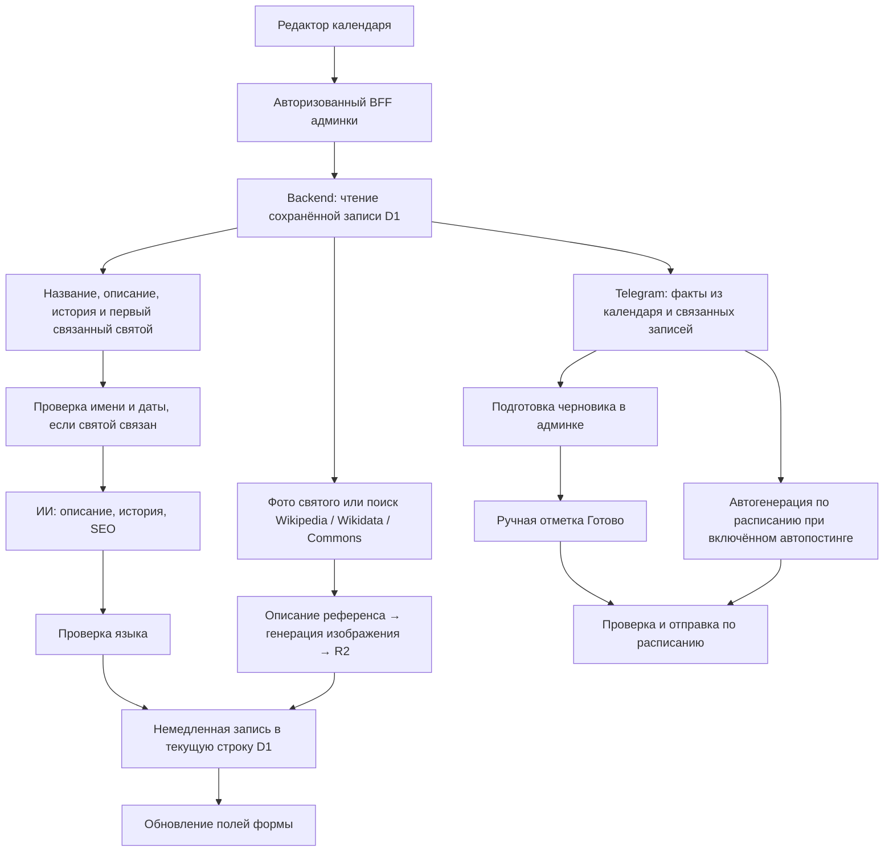

# Аудит ИИ в админке — 10 сентября 2026

Проверены исходники `svetikony-admin` и `svet-ikony`, цепочки календаря, изображений и Telegram, существующие тесты. Это анализ локального кода: соответствие production этой версии, фактические настройки автопостинга, расходы и качество конкретных опубликованных материалов не проверялись. Платные генерации и отправки не запускались. Код приложения не изменён.

## Вывод

ИИ уже умеет редактировать контент, но целостная цепочка «достоверный источник → проверенный черновик → одобрение → публикация» не обеспечена. Основные проблемы находятся в связях данных, сохранении и публикации; замена модели сама по себе их не исправит.

## Как всё работает сейчас

**Календарь.** Кнопки работают только с уже созданной записью. Запрос передаёт ID, а не текущие несохранённые значения формы. Backend получает данные из D1 и генерирует короткое описание, историю, SEO title и SEO description. «Заполнить отсутствующее» последовательно выполняет эти действия и добавляет изображение; это до четырёх текстовых генераций, плюс возможный анализ референса и генерация картинки. Аудио автоматически не создаётся.

**Изображения календаря.** Приоритет: существующее фото связанного святого → поиск личности в Wikipedia/Wikidata и изображения, включая Commons → текстовое описание изображения моделью → новая AI-иллюстрация → загрузка в R2. При отсутствии подтверждённой личности используется общий храмовый сюжет. Пользовательский промпт обходит поиск и передаётся генератору напрямую. Это не перенос исходной иконы пиксель в пиксель.

**Telegram.** Есть отдельная цепочка для молитв, святого дня, Евангелия и статьи о вере. Она берёт факты из связанных записей D1 и формирует украинский пост с заданной структурой и двумя стилями даты. Ручная подготовка сохраняет черновик, затем можно отметить его готовым. Но cron также имеет самостоятельный путь генерации и отправки, не требующий ручной готовности.

В просмотренных формах других разделов универсального AI-автозаполнения не найдено. Святого, молитву, чтение и их связи нужно подготовить отдельно. Настройки моделей читаются из окружения; значения по умолчанию в коде — `gpt-4o-mini` для текста/анализа референса и `gpt-image-1` для изображений. Это не подтверждение моделей, реально выбранных в production.

## Что уже сделано хорошо

- AI-вызовы находятся на backend; маршруты календаря защищены административной авторизацией.
- Разделены «сгенерировать отсутствующее» и явная регенерация существующего поля.
- Telegram пропускает генерацию при отсутствии нужной исходной записи; для готовых постов есть атомарный переход `ready → sending`, защищающий эту ветку от конкурирующей отправки.
- Есть общая проверка языка после генерации и перед отправкой Telegram.
- Для изображений сохраняются метаданные происхождения и ссылки на найденный референс; существующее фото святого имеет приоритет.
- Подготовка Telegram-дня сама по себе не отправляет сообщения и не отмечает их готовыми.

## Проблемы и доказательства

### 1. Связи в форме календаря не сохраняются в реальном режиме — P0

`relatedSaintIds`, `relatedPrayerIds`, `relatedIconIds`, `relatedGospelIds` всегда восстанавливаются как пустые массивы и не включаются в payload сохранения. При этом поля выбора доступны в UI. Backend ИИ ищет обратную связь `saint.calendarDayId`, о которой выбор в этой форме ничего не сообщает.

Следствие: администратор может выбрать святого, сохранить день и ожидать соответствующую генерацию, но ИИ не получит эту связь. Проверка личности может быть пропущена, изображение — оказаться общим, Telegram — сообщить об отсутствии источника.

Доказательства: [адаптер календаря](lib/api/http/calendar-days.ts#L25), [поля формы](features/calendar/calendar-day-form.tsx#L349), [поиск святого](/Users/dmitrijfomin/Desktop/svet-ikony/lib/church/calendar-ai-actions.ts:84).

### 2. Новая дата из админки не получает старый стиль — P0

Адаптер отправляет только `dateNewStyle`. Backend сохраняет `dateOldStyle` как `null`, если поле отсутствует. Telegram ищет день исключительно по старому стилю; проверка связанного святого также требует эту дату. При редактировании новой даты старое значение, если оно было, не пересчитывается.

Следствие: созданный через UI день может быть виден в календаре, но недоступен для Telegram; после переноса даты возможна несогласованная пара дат.

Доказательства: [payload](lib/api/http/calendar-days.ts#L64), [создание записи](/Users/dmitrijfomin/Desktop/svet-ikony/lib/d1/repositories/calendarDays.ts:200), [выбор дня Telegram](/Users/dmitrijfomin/Desktop/svet-ikony/lib/telegram/autopost-content.ts:50).

### 3. Ответ одного AI-действия заменяет несколько полей формы — P0

`applyDay()` после любой генерации записывает сразу описание, историю, оба SEO-поля и изображение. Проверки `dirtyFields` нет. Например: редактор меняет историю, нажимает генерацию картинки — ответ сервера возвращает старую историю и заменяет ручной текст. Несохранённые изменения названия/источников также не попадают в запрос генерации. Кнопки блокируют только собственную операцию, а не все операции записи этой карточки.

Дополнительно на backend нет проверки версии строки: чтение текущих значений и полный `UPDATE` допускают потерю конкурирующих изменений. Это риск по коду, нагрузочный сценарий не воспроизводился.

Доказательства: [applyDay и мутации](features/calendar/use-calendar-ai-actions.ts#L67), [UPDATE](/Users/dmitrijfomin/Desktop/svet-ikony/lib/d1/repositories/calendarDays.ts:241).

### 4. Генерация календаря не изолирована от уже опубликованной версии — P0

Комментарии обещают «сохранение только в draft», но фактически AI-действия сразу обновляют текущую запись и сохраняют её прежний статус. Для `published` это означает изменение публичных данных без отдельного принятия AI-версии. Публичная страница читает эту же строку.

Сам статус `draft` автоматически не превращается в `published`; проблема именно в изменении уже опубликованной записи.

Доказательства: [генерация и updateCalendarDay](/Users/dmitrijfomin/Desktop/svet-ikony/lib/church/calendar-ai-actions.ts:159), [сохранение статуса](/Users/dmitrijfomin/Desktop/svet-ikony/lib/d1/repositories/calendarDays.ts:267), [чтение публичной страницы](/Users/dmitrijfomin/Desktop/svet-ikony/app/church/calendar/[date]/page.tsx:67).

### 5. Telegram не гарантирует ручное одобрение — P0 для редакционного режима

Cron сначала пытается взять готовый слот. Если такого нет, он может загрузить факты, занять новый или существующий `draft`-слот, заново сгенерировать текст и отправить его. Поэтому «не отмечать готовым» не является гарантией запрета отправки. Исходные записи календаря/молитв/святых при загрузке фактов также не фильтруются по `published` или отдельному признаку редакционного одобрения.

Это реализованный автоматический режим, а не доказанный сбой production. Нужно явно разделить режимы: «отправлять только одобренное» и «автоматически готовить и отправлять». Для существующего черновика нельзя неявно заменять ручную работу.

Отдельная проблема конкурентности: `claimAutopostSlot()` оставляет строку в `draft`, а следующий вызов может снова успешно получить её через `ON CONFLICT ... WHERE status = 'draft'`. В отличие от ветки `ready → sending`, это не эксклюзивная блокировка. При перекрывающихся тиках возможны повторные генерации и отправки; это вывод из SQL, реальную двойную отправку не запускал. Нужен атомарный переход в состояние обработки с владельцем/сроком блокировки.

Доказательства: [две ветки cron](/Users/dmitrijfomin/Desktop/svet-ikony/lib/telegram/autopost.ts:155), [занятие draft-слота](/Users/dmitrijfomin/Desktop/svet-ikony/lib/d1/repositories/telegram-autopost.ts:140), [источники](/Users/dmitrijfomin/Desktop/svet-ikony/lib/telegram/autopost-content.ts:63).

### 6. Проверка фактов имеет ограниченное покрытие — P1

«Два источника» здесь означают две встроенные таблицы по 29 датам, а не текущий поиск в интернете для каждого дня. Диапазон — 18 августа–17 сентября старого стиля с двумя пропусками. За его пределами проверка возвращает отсутствие справочных данных. Совпадение кандидата проверяется включением имени как подстроки; биография, места, исторические даты и утверждения результата не проверяются.

Если связанного святого нет, проверка пропускается, даже если название дня фактически содержит имя святого. Достаточно одного названия, чтобы запустить текстовую генерацию. Уже сгенерированные описание и история затем становятся «фактами» для следующих генераций без маркировки происхождения. Возможна цепочка усиления исходной ошибки.

Доказательства: [справочники](/Users/dmitrijfomin/Desktop/svet-ikony/lib/telegram/orthodox-calendar-sources.ts:46), [сопоставление имени](/Users/dmitrijfomin/Desktop/svet-ikony/lib/telegram/orthodox-calendar-verifier.ts:71), [проверка и сбор фактов](/Users/dmitrijfomin/Desktop/svet-ikony/lib/church/calendar-ai-actions.ts:103).

### 7. Ошибки изображений и заполнения маскируются — P1

При ошибке регенерации или пользовательского промпта и наличии старого изображения функция возвращает старую запись как успешный ответ. Редактор не узнаёт, что новое изображение не создано. «Заполнить отсутствующее» при нуле заполненных полей показывает «всё уже заполнено», даже когда поля пропущены из-за ошибок, а любую причину пропуска UI объясняет необходимостью исправить источник.

При неудачном анализе референса (`iconographyNotes == null`) код всё равно генерирует конкретного святого по имени. Метаданные сохраняют `identityVerified: true`, хотя пригодность референса и качество новой иллюстрации этим не подтверждены. При повторном использовании референс не сверяется с идентичностью нового связанного святого.

Доказательства: [ветка референса](/Users/dmitrijfomin/Desktop/svet-ikony/lib/church/calendar-ai-actions.ts:304), [возврат старой картинки](/Users/dmitrijfomin/Desktop/svet-ikony/lib/church/calendar-ai-actions.ts:385), [уведомления](features/calendar/use-calendar-ai-actions.ts#L136).

### 8. Язык и формат контролируются частично — P1

Текст календаря всегда генерируется на украинском, независимо от `day.language`; AI-кнопки доступны и при работе с переводами. Возможна запись украинского текста в RU/EN-карточку. Ограничения длины SEO заданы в промпте, но не проверяются сервером после генерации.

Языковой guard — эвристика, а не полноценное определение языка. Прямой локальный запуск подтвердил, что обе строки проходят с `{ok: true}`:

- `Сегодня день памяти святого`
- `Молитва приносить peace серцю`

Доказательства: [промпт и ответ](/Users/dmitrijfomin/Desktop/svet-ikony/lib/ai/church-content.ts:15), [guard](/Users/dmitrijfomin/Desktop/svet-ikony/lib/ai/language-guard.ts:55), [переключение языка и AI-кнопки](features/calendar/calendar-day-form.tsx#L213).

### 9. Долгие операции недостаточно наблюдаемы — P1/P2

В BFF и браузере настроены увеличенные таймауты, но вызовы OpenAI внутри backend не получают собственного `AbortSignal`, ограниченного retry или ID идемпотентной задачи. Полное заполнение — один долгий HTTP-запрос с промежуточными сохранениями. Таймаут ответа не даёт пользователю достоверного ответа, какие шаги завершились; повторный запуск может повторить ещё выполняющуюся платную работу. Продолжение работы после разрыва зависит от runtime и отдельно не проверялось.

Текстовые ответы не сохраняют usage, версию промпта и снимок источников. Есть полезные console-логи изображений и метаданные Telegram, но нет единого журнала всей AI-операции. Telegram не переиспользует иллюстрацию календаря: при отсутствии фото у самого святого генерирует отдельный общий сюжет.

Доказательства: [таймауты клиента](lib/api/http/calendar-days.ts#L96), [последовательное заполнение](/Users/dmitrijfomin/Desktop/svet-ikony/lib/church/calendar-ai-actions.ts:474), [OpenAI fetch](/Users/dmitrijfomin/Desktop/svet-ikony/lib/ai/openai.ts:138), [изображение Telegram](/Users/dmitrijfomin/Desktop/svet-ikony/lib/telegram/autopost-image.ts:80).

## План улучшения

| Этап | Что сделать | Критерий готовности |
|---|---|---|
| 1. Целостность данных | Реально сохранять обратные связи; вычислять и проверять обе даты на сервере по календарной политике; выбирать связанный источник по ID и языку, а не первый попавшийся | День, созданный в UI, после перезагрузки сохраняет связи; его видит Telegram; перенос даты не оставляет старую пару |
| 2. Безопасное редактирование | Возвращать и применять только изменённые поля; учитывать ручные правки; проверять версию записи; блокировать пересекающиеся действия. AI-результат хранить как предлагаемую редакцию, опубликованную версию менять только при принятии | Генерация картинки не меняет введённую историю; конкурирующая запись вызывает понятный конфликт; публикация не меняется от генерации |
| 3. Явная политика Telegram | Разделить режим отправки одобренных постов и полностью автоматический; защитить ручные draft; учитывать редакционное одобрение источников; привязывать проверку к версии текста; обеспечить эксклюзивное занятие слота в обеих ветках cron | В редакционном режиме неподтверждённый слот не отправляется и не перегенерируется cron; два тика не генерируют и не отправляют один слот одновременно |
| 4. Источники и качество | Создать версионируемый справочник на весь необходимый календарный период с несколькими поминовениями на день; хранить source URL, идентификатор святого, проверенные факты и дату проверки; AI-текст не использовать как первичный источник. Проверять язык, имена, даты, длину SEO и цитаты | Для каждого текста понятно, какие утверждения подтверждены; неоднозначный день получает объяснимое «нужна проверка»; RU/EN не заполняются украинским |
| 5. Изображения | Разделить статусы «личность найдена», «референс пригоден», «результат просмотрен»; сбрасывать референс при смене святого; честно показывать ошибки и сохранение старой картинки; переиспользовать одобренный календарный asset в Telegram | Негодный референс не приводит к уверенно маркированному портрету; повторное использование не создаёт лишнюю генерацию |
| 6. Выполнение и журнал | Добавить задачи со статусами шагов, идемпотентностью и ограниченными повторами; сохранять модель, версию промпта, хеш/снимок источников, длительность, usage, результат и причину отказа. Показывать прогресс и повтор конкретного шага | После обновления страницы виден результат задачи; один повтор не запускает дубликат; стоимость и причины ошибок прослеживаются |

Начинать с этапов 1–3: они устраняют потерю данных и неочевидные публикации. Затем улучшать источники и качество; фоновое выполнение вводить после определения корректных состояний и правил сохранения. Общий стиль админки и архитектуру публичного визуализатора для этого менять не требуется.

## Проверки

- Admin: 5 файлов, **60 тестов прошли** — календарные AI-actions, Telegram slot-card и prepare-day-panel, transport, BFF proxy.
- Backend: 10 файлов, **216 тестов прошли** — AI-клиенты текста, guard языка, календарные AI-actions, поиск референсов, Telegram preparation/autopost/facts и pre-send/calendar verification.
- Отдельно выполнены две проверки обхода языковой эвристики и подсчёт покрытия обоих справочников: по **29 дат**.
- Эти тесты используют моки; они подтверждают существующее поведение, но не достоверность реальных генераций и не доступность внешних сервисов. Сборку не запускал: изменён только этот отчёт.

Для реализации нужны регрессионные сценарии: сохранение связей и дат через настоящий API, dirty-поле + AI другой вкладки, два одновременных сохранения, генерация для published-записи, draft Telegram при cron, изменение святого с прежним референсом, ошибка изображения при наличии старого, частичное заполнение, RU/EN-карточки и даты за пределами встроенного справочника. Завершить staging-проверкой на реальной D1 и ручной редакционной оценкой разрешённой выборки генераций.
