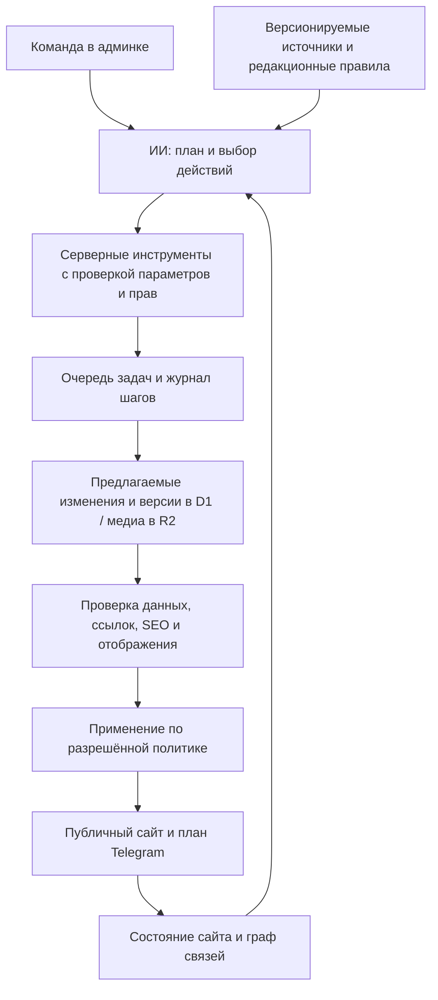

# ИИ-оператор сайта и календарь на год

Дата: 10 сентября 2026. Предложение по результатам чтения двух репозиториев и официальной документации. Это проект развития, а не уже реализованные возможности. Production-данные, доступность внешних интеграций и фактическое годовое покрытие D1 не проверялись.

## Реализуемость

Да: можно встроить в админку оператора, которому задают задачу обычными словами, а он читает состояние сайта, составляет план, вызывает действия backend, проверяет изменения и показывает результат. Можно подготовить весь выбранный год и поддерживать его автоматически. Достоверность церковных фактов должна обеспечиваться источниками и правилами календаря; модель отвечает за подготовку и редактирование материалов.

«Как в Blender» здесь означает замкнутый цикл: получить объекты и их состояние → выполнить конкретные команды → перечитать состояние → проверить результат. Для сайта объектами будут дни, святые, молитвы, иконы, статьи, переводы, URL и связи. Снимок экрана нужен для проверки отображения; точные данные оператор получает через API.

## Что уже есть и чего не хватает

| Область | Есть в коде | Нужно добавить |
|---|---|---|
| Доступ к данным | BFF и backend CRUD для основных разделов | Сводный снимок сайта, поиск объектов и входящих/исходящих связей |
| Генерация | Календарные поля, изображения, Telegram | Планировщик задач, структурированные действия, единая проверка результата |
| Порядок в админке | Счётчики переводов, изображений, черновиков, аудио | Проверяемые критерии готовности, список проблем с причинами, массовая обработка |
| Источники | Два встроенных календарных справочника по 29 дат | Версионируемое покрытие выбранного года и календарной традиции |
| Годовой контент | Seed на 30 дней сентября 2026 | Подтверждённые чтения, поминовения и правила для всех дней года |
| Связи | Отдельные внешние ключи `calendar_day_id`, `icon_id` | Реальная запись связей из всех форм; переиспользование объектов в нескольких датах |
| SEO | Metadata, canonical, hreflang, sitemap, JSON-LD | Общий аудит фактически отрисованных страниц и контроль изменений |
| История действий | `admin_audit_log` | Версии контента, наборы изменений, журнал шагов AI, восстановление версии |

Новые наблюдения после первого аудита:

- Заглушки связей есть также в HTTP-адаптерах святых и икон: соответствующие массивы возвращаются пустыми. У молитв и Евангелия часть одиночных связей уже передаётся правильно.
- Сборщик публичной страницы календаря получает иконы, молитвы, статьи и чтения, но не добавляет список святых. Поэтому наличие связи в D1 ещё не означает, что она доступна читателю как ссылка.
- Проверенный локально seed содержит 30 дней, 27 новых объектов святого, 5 чтений и 16 историй. В первой дате святой пропущен как уже существующий; эти числа не являются инвентаризацией production.
- В проекте есть преобразование григорианской даты в юлианскую, но seed явно оставляет многие чтения пустыми из-за отсутствия надёжного источника для подвижного годового цикла. Преобразования двух дат недостаточно для полного церковного календаря.

Доказательства: [адаптер святых](lib/api/http/saints.ts), [адаптер икон](lib/api/http/icons.ts), [публичная композиция](/Users/dmitrijfomin/Desktop/svet-ikony/lib/church-public/calendar-page.ts), [seed](/Users/dmitrijfomin/Desktop/svet-ikony/scripts/calendar-seed/data.mjs), [конвертация дат](/Users/dmitrijfomin/Desktop/svet-ikony/lib/telegram/julian-calendar.ts), [SEO](/Users/dmitrijfomin/Desktop/svet-ikony/lib/seo.ts), [журнал](/Users/dmitrijfomin/Desktop/svet-ikony/lib/d1/repositories/admin-audit-log.ts). Ошибки сохранения и публикации разобраны в [первом аудите](AI_ADMIN_AUDIT.md).

## Предлагаемая система

### Инструменты оператора

На первом этапе достаточно одного агента с небольшим набором специализированных действий. Предлагаемые имена ниже — новые интерфейсы, сейчас их в проекте нет:

- `get_site_inventory`, `get_entity`, `get_relations`, `get_year_coverage` — читать точное состояние и пробелы.
- `find_source`, `get_source_record` — получать данные с происхождением и статусом проверки.
- `propose_content`, `propose_translation`, `propose_links`, `propose_seo` — готовить изменения для конкретных ID и версий записей.
- `validate_change_set`, `preview_page` — проверять влияние на связанные материалы и публичное отображение.
- `apply_change_set`, `restore_revision` — применять разрешённый набор изменений или восстанавливать прежнюю редакцию с проверкой текущей версии.
- `get_job_status`, `cancel_job` — наблюдать выполнение и останавливать оставшуюся работу.

Технически можно подключить эти функции через OpenAI tool calling. Строгая схема ограничивает форму аргументов, но существование ID, права, дату, корректность связи и версию записи проверяет сам backend. [OpenAI: function calling](https://developers.openai.com/api/docs/guides/function-calling).

Для чата внутри админки прямых серверных функций достаточно. Если позже нужен доступ к тем же действиям из внешнего AI-клиента, поверх них можно сделать MCP-адаптер. MCP даёт интерфейс подключения инструментов, а не автоматически готовую бизнес-логику. [OpenAI: MCP](https://developers.openai.com/api/docs/guides/tools-connectors-mcp).

Оператор работает от собственной ограниченной роли с указанием инициировавшего пользователя. Чтение внешней статьи не даёт ей права управлять сайтом: текст источника обрабатывается как данные. Универсальные SQL, shell и изменение кода не входят в инструменты контентного оператора. Изменения приложения и инфраструктуры остаются отдельным процессом разработки с проверками.

### Как ИИ увидит перелинковку

Нужны два представления: смысловые связи объектов и реальные ссылки между опубликованными страницами. Они связаны, но не тождественны. Оператор должен знать тип связи, исходный и целевой ID, язык, источник связи, статус публикации и реальный URL.

Пример: день → поминовение святого → его житие → молитва → икона. Для каждой страницы строится список входящих/исходящих ссылок. Проверка выявляет страницы без входящих ссылок, неправильную языковую версию, ссылки на черновики, несуществующие цели и дубли сущностей. Смысловые рекомендации ИИ превращаются в реальные ссылки только после разрешения ID и проверки страницы.

Для старта достаточно таблиц связей и индексов в существующей D1; отдельная графовая база не обязательна. Полнотекстовый или семантический поиск можно подключить для поиска кандидатов, но совпадение имени или близость текстов не должны автоматически объединять двух разных святых.

Проверять нужно и HTML: клики на глобусе не заменяют доступные ссылки на материалы. Google рекомендует ссылки с `href`, содержательный текст и контекстную внутреннюю перелинковку; универсального количества ссылок на страницу нет. [Google: ссылки](https://developers.google.com/search/docs/crawling-indexing/links-crawlable).

### Как поддерживать SEO

Планируемый SEO-аудитор проверяет уникальность и смысл title/description, заголовки, canonical, языковые альтернативы, sitemap, индексируемость, разметку, изображения и внутренние ссылки. Он читает как поля CMS, так и итоговую страницу: правильное значение в базе не гарантирует правильный HTML.

Правила URL, canonical и языковых альтернатив следует вычислять программно. ИИ полезен для названий, описаний, тематических связей и объяснения приоритетов. Изменение slug должно учитывать перенаправления и все входящие ссылки; его нельзя выполнять как обычную замену текста.

Цель — полезные и достоверные страницы года. Заполнение одинаковым текстом всех полей ради числа страниц не является критерием SEO-готовности. Google отдельно требует внимания к точности, качеству и релевантности AI-контента, включая метаданные. [Google: генеративный контент](https://developers.google.com/search/docs/fundamentals/using-gen-ai-content).

Search Console можно добавить позже как источник показов, кликов и проблем индексирования при наличии доступа. До подключения оператор должен честно показывать «данных поиска нет», а не оценивать позиции по содержимому базы. Рост трафика нельзя обещать только на основании автоматического заполнения.

## Как правильно заполнить год

Перед импортом фиксируются год либо точный диапазон, календарная традиция, часовой пояс и основной язык. Текущий проект использует старый стиль для Telegram, Europe/Kyiv и украинский контент; это отправная точка, не основание менять церковную политику автоматически. Поддерживается 365 или 366 дней в зависимости от выбранного года.

1. **Создать календарную основу.** Даты и годовые правила рассчитывает проверяемый код или поставляет выбранный надёжный календарный источник. Подвижные праздники и порядок чтений требуют отдельного источника/правил; ИИ не угадывает их.
2. **Импортировать подтверждённые поминовения и чтения.** Хранить источник, редакцию, календарную традицию и причину расхождения. Различие «главного» поминовения у двух источников не считать автоматически ошибкой: на одной дате может быть несколько записей, а редакционный приоритет задаётся отдельно.
3. **Переиспользовать постоянные материалы.** Один святой, одна версия молитвы или жития связываются с несколькими датами. Для этого нужны добавочные таблицы связей и отделение постоянной сущности от её вхождения в конкретный год. Миграция должна сохранять существующие ID и маршруты.
4. **Подготовить редакционные поля.** ИИ пишет краткое описание, изложение подтверждённых фактов, SEO и переводы. Канонические молитвы и текст чтения берутся из утверждённых редакций; перевод или пересказ не подменяет исходный текст. Иллюстрация имеет понятное происхождение.
5. **Проверить и применить пакет.** Проверки дат, источников, языков, дублей, отношений и страниц выполняются для каждого дня. Источников нет — день остаётся с явным пробелом, а не получает выдуманное содержание для зелёного индикатора.
6. **Поддерживать год.** После исправления источника заново проверять зависимые черновики, SEO и Telegram. Одобренную редакцию нельзя молча заменять вслед за изменением источника.

Для полного календарного дня предлагаю требовать обе даты, соответствующие традиции поминовения/праздник, подтверждённые чтения по заданному правилу, доступные связанные материалы, проверенные обязательные поля и работающую публичную страницу. Отдельная новая статья, отдельное изображение и аудио нужны не обязательно каждому дню: допустимо корректное переиспользование. Доступность изображения/аудио считать отдельными метриками.

При трёх языках год может содержать 1095 языковых версий дневной страницы, плюс постоянные материалы. Это не значит, что нужно создать столько новых независимых сущностей. При пяти ежедневных слотах Telegram получится 1825 слотов на обычный год; их разумнее готовить скользящим окном, например на ближайшие 14–30 дней, из уже проверенной годовой базы.

## Как будет выглядеть админка

Сохраняется текущий дизайн, добавляются функциональные представления:

- **ИИ-помощник:** чат с командами «Проверь ноябрь», «Подготовь недостающие переводы», «Найди страницы без входящих ссылок». Результат — список конкретных действий, текущий прогресс и проверенный итог.
- **Покрытие года:** день × источники / чтения / текст / связи / переводы / медиа / SEO / публикация. «Проверено», «заполнено» и «опубликовано» — разные показатели.
- **Проблемы:** сначала блокирующие публикацию, затем недостающие материалы и улучшения. У каждой записи есть причина, источник и действие для исправления.
- **Связи:** таблица зависимостей с возможностью открыть граф для выбранной сущности; исправления видны и в обычных формах.
- **Предлагаемые изменения:** сравнение было/стало, использованные источники, затрагиваемые страницы, принять/отклонить пакет.
- **Задания:** этап, длительность, расход, ошибки и повтор отдельного шага. Обновление страницы не теряет выполнение.

## Уровни автоматизации

| Режим | Действия |
|---|---|
| Автоматический аудит | Чтение, проверка ссылок, поиск пробелов, составление плана; не меняет публичное содержимое |
| Автоматическая подготовка | Заполнение и перевод черновиков из разрешённых источников, создание предложений связей/SEO в пределах бюджета |
| Работа по заранее заданным правилам | Применение разрешённых типов изменений и публикация одобренных материалов по расписанию |
| Редакционное решение | Расхождения источников, сомнительная идентичность, замена утверждённых фактов, изменение URL, объединение/удаление сущностей |

Правила и лимиты задаются один раз для операции или серии задач; постоянное подтверждение каждого мелкого шага не требуется. Приложение принудительно проверяет эти правила независимо от текста ответа модели. Можно расширять автономность после накопления измеримых результатов.

## Порядок реализации и критерии приёмки

| Этап | Конкретный результат | Условие перехода дальше |
|---|---|---|
| 0. Исправить основание | Связи, две даты, защита ручных правок и опубликованных версий, конкурентность Telegram | Регрессионные сценарии первого аудита проходят на staging |
| 1. Оператор-аудитор | Реальный снимок CMS, граф связей, покрытие года, SEO-проблемы и чат с чтением | Любая показанная проблема подтверждается ID/URL и воспроизводимой проверкой |
| 2. Подготовка недели | Источники, инструменты записи черновиков, версии и сравнение, очередь с лимитом | Проверены 7 разных по типу дней, включая недостаточные и противоречивые источники |
| 3. Пилот месяца | Полный набор дня, переводы, медиа, реальные связи и публичный preview | Пройдена редакционная оценка 30 дней, нет потерь ручного текста, видны все пропуски и расходы |
| 4. Год | Импорт и подготовка пакетами с возобновлением | Все 365/366 дат учтены; обязательные данные проверены либо явно блокируют готовность; нет скрытых пустот |
| 5. Постоянный режим | Регулярный аудит сайта, обновление зависимых черновиков и одобренное расписание | Стабильный повторный запуск без дублей, подтверждённое восстановление версий и соблюдение бюджета |

Тестировать нужно всю последовательность действий, а не только качество отдельного ответа: какие данные прочитал оператор, какой объект изменил, какие поля сохранил и что стало видно на сайте. Для этого применимы трассировка и оценка сценариев агента. [OpenAI: оценка agent workflows](https://developers.openai.com/api/docs/guides/agent-evals).

Контрольные сценарии: один святой в нескольких датах, одинаковые имена разных святых, два поминовения за день, граница года/високосный день, конфликт календарных источников, отсутствующее чтение, отсутствующий перевод, изменение slug, повтор фоновой задачи, два редактора, опубликованная версия и изменившийся источник, непригодный референс изображения.

Стоимость и срок всего внедрения корректно оценивать после пилота: отдельно учитывать подготовку/проверку источников, текст, переводы, изображения, повторы и редакционную работу. Заранее задаются максимальная стоимость пакета, число попыток и лимит изображений. Модели выбирать на одном контрольном наборе по качеству и фактическому расходу; обучение собственной модели для первого этапа не требуется.

Рекомендация: начать с исправления данных и оператора-аудитора. Это позволит уже первой версией навести измеримый порядок, а затем подключить годовое заполнение к тем же инструментам, проверкам и журналу без перестройки публичного сайта.
